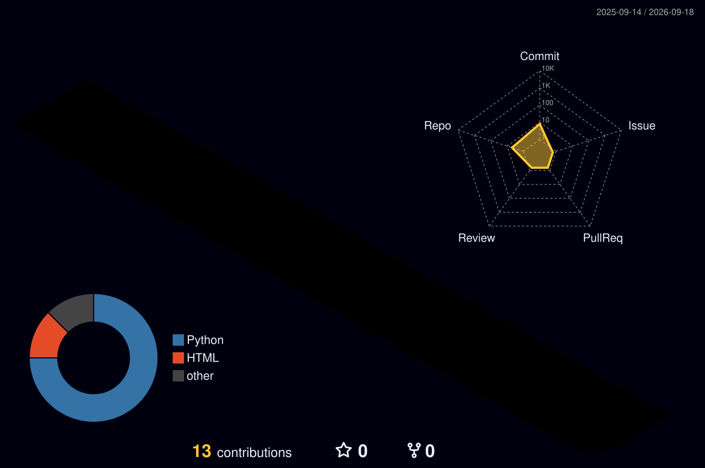

<div align="center">

# 👋 Hi, I'm Edwin.Wang

### ☁️ Cloud Computing Engineer · Cloud Native · DevOps / SRE · AI Infra

<p>
  <strong>
    Kubernetes · Linux · Cloud Native · Observability · Storage · Automation · Platform Engineering
  </strong>
</p>

[](https://git.io/typing-svg)

<br/>

[](https://github.com/EdwinWang0225?tab=followers)
[](https://github.com/EdwinWang0225?tab=repositories)


<br/>

[](https://EdwinWang0225.github.io)
[](mailto:1799577686@qq.com)
[](https://x.com/OlavTom0225)

</div>

---

## 👨‍💻 About Me

I'm focusing on **Cloud Computing, Cloud Native Infrastructure, DevOps / SRE and Platform Engineering**, with a growing interest in **AI Infrastructure, LLMOps and GPU Operations**.

我更关注的不只是“让服务运行起来”，而是：

- 如何设计可靠、可扩展、可观测的基础设施
- 如何标准化 Kubernetes / Linux / Storage / Network 运维流程
- 如何通过 CI/CD、GitOps 与自动化降低人工操作风险
- 如何构建 Metrics / Logs / Traces / Alerts 可观测体系
- 如何把故障处理沉淀为 SOP / Runbook / Troubleshooting / RCA
- 如何将 AI、Agent 与自动化运维结合到工程体系中

> **Infrastructure should be reproducible, observable, recoverable and automatable.**

---

## 🎯 Engineering Focus

| Area | Focus |
| --- | --- |
| ☸️ **Kubernetes** | Cluster Lifecycle · Workload · Scheduling · Service · Gateway API · CNI · CSI |
| 🌐 **Cloud Native Networking** | Cilium · Hubble · Envoy Gateway · HTTP/2 · gRPC · NetworkPolicy |
| 💾 **Storage** | Ceph · Rook-Ceph · Block / File / Object Storage · Distributed Storage |
| 📊 **Observability** | Prometheus · Grafana · Alertmanager · Metrics · Logs · Events |
| 🔐 **DevSecOps** | Harbor · Trivy · Cosign · Image Supply Chain · CI/CD Security |
| ⚙️ **Automation** | Bash · Python · Ansible · GitHub Actions · Jenkins · GitOps |
| ☁️ **Cloud & Virtualization** | VMware vSphere · vSAN · HCI · Private Cloud · Public Cloud |
| 🤖 **AI Infra** | LLMOps · Model Serving · AI Agent Tooling · Token / Cost Observability |

---

## 🧩 Engineering Practice

### ☸️ Kubernetes & Cloud Native

- Kubernetes cluster lifecycle and production-style operations
- Cilium networking and Hubble network observability
- Gateway API and Envoy Gateway traffic management
- Service / EndpointSlice / DNS / NodePort connectivity troubleshooting
- NetworkPolicy and workload isolation
- Kubernetes monitoring and alerting
- Rook-Ceph based persistent storage

### 📊 Observability

- Prometheus metric collection and recording rules
- Grafana dashboards
- Alertmanager alert routing
- Kubernetes / Ceph / Cilium monitoring
- Metrics / Logs / Events based troubleshooting
- SLI / SLO oriented observability practices

### 🔐 DevOps & DevSecOps

- Jenkins based Kubernetes deployment pipelines
- Harbor private registry
- Trivy image vulnerability scanning
- Cosign image signing
- Container image lifecycle management
- GitHub Actions automation
- GitOps and progressive delivery practices

### 💾 Storage & Infrastructure

- Ceph / Rook-Ceph
- SeaweedFS distributed object storage
- iSCSI / NFS / FC SAN
- RAID / LVM / Filesystem
- VMware vSphere / vSAN
- Backup / Restore / HA / DR practices

### 🤖 AI Infra & LLMOps

- AI Agent / CLI engineering environment
- Multi-model API and model gateway exploration
- Token usage and cost observability
- LLM inference infrastructure
- AI Infra / GPU Ops / LLMOps knowledge system
- AIOps and automated remediation exploration

---

## 🛠️ Tech Stack

### Languages & Automation

<p>
  
</p>

`YAML` · `JSON` · `SQL` · `Shell`

### Backend & Data

<p>
  
</p>

### Container & Kubernetes

<p>
  
</p>


### CI/CD & Platform Engineering

<p>
  
</p>


### Observability

<p>
  
</p>


### Development Environment

<p>
  
</p>

`WSL2` · `Zsh` · `tmux` · `Starship` · `nerdctl` · `kubectl` · `Helm`

---

## 📦 Featured Engineering Projects

| Project | Description | Focus |
| --- | --- | --- |
| **kubernetes-lab** | Production-style Kubernetes laboratory and cloud-native platform | Kubernetes · Cilium · Gateway API · Ceph |
| **infra-knowledge** | Structured infrastructure knowledge & SOP system | SOP · Runbook · Troubleshooting · RCA |
| **homelab** | Personal infrastructure / virtualization / storage laboratory | Linux · VMware · Storage · Networking |
| **ai-tooling** | AI CLI / Agent / model gateway / token observability experiments | AI Infra · LLMOps · Agent |

> 📌 当对应仓库准备好后，把这 4 个项目设置为 GitHub Pinned Repositories，并把项目名改成实际仓库链接。

---

## 🧠 Infra Knowledge OS

I'm building a structured engineering knowledge system based on:

```text
Domain
└── Capability
    └── Asset Type
        └── Subject
```

Knowledge assets are divided into:

```text
SOP
├── Runbook
├── Troubleshooting
├── Incident
├── RCA / Postmortem
└── Checklist
```

The goal is to turn engineering experience into:

```text
Standardized
→ Reproducible
→ Verifiable
→ Recoverable
→ Automatable
→ AI-Searchable
```

---

## 🔭 What I'm Working On

- ☸️ Kubernetes production engineering
- 🌐 Cilium / Hubble networking
- 🚪 Gateway API / Envoy Gateway
- 💾 Ceph / Rook-Ceph distributed storage
- 📊 Prometheus / Grafana observability
- 🔐 DevSecOps and software supply chain
- 🔄 GitOps and progressive delivery
- 🤖 AI Infra / LLMOps / GPU Ops
- 🧠 Infrastructure Knowledge OS
- 🛠️ AI-assisted infrastructure automation

---

## 🗺️ Engineering Roadmap

```text
Cloud Computing
      │
      ├── Linux
      ├── Network
      ├── Storage
      ├── Database
      │
      ▼
Container
      │
      ▼
Kubernetes
      │
      ├── CNI / CSI
      ├── Gateway API
      ├── Observability
      ├── Security
      │
      ▼
Cloud Native Platform
      │
      ├── CI/CD
      ├── GitOps
      ├── Platform Engineering
      ├── SRE
      │
      ▼
AI Infrastructure
      │
      ├── GPU Ops
      ├── LLMOps
      └── AIOps
```

---

## 📊 GitHub Engineering Dashboard

<div align="center">


<br/>


</div>

> GitHub language statistics reflect repository composition rather than overall engineering proficiency.

---

## ⌨️ Coding Activity

<!--START_SECTION:waka-->

```txt
From: 15 September 2026 - To: 22 September 2026

Total Time: 1 hr 34 mins

YAML                       1 hr 13 mins          █████████████████▒░░░░░░░   69.74 %
Other                      11 mins               ██▓░░░░░░░░░░░░░░░░░░░░░░   10.62 %
Text                       10 mins               ██▒░░░░░░░░░░░░░░░░░░░░░░   09.65 %
Markdown                   7 mins                █▓░░░░░░░░░░░░░░░░░░░░░░░   06.67 %
Docker                     2 mins                ▓░░░░░░░░░░░░░░░░░░░░░░░░   02.10 %
Nginx configuration file   0 secs                ░░░░░░░░░░░░░░░░░░░░░░░░░   00.64 %
Java Properties            0 secs                ░░░░░░░░░░░░░░░░░░░░░░░░░   00.35 %
TOML                       0 secs                ░░░░░░░░░░░░░░░░░░░░░░░░░   00.13 %
```

<!--END_SECTION:waka-->

---

## 🤖 AI / Token Usage

AI tooling is becoming part of my engineering workflow, including:

- AI coding agents
- Model gateways
- Multi-model routing
- Token usage tracking
- Cost observability
- CLI-based AI workflows
- LLMOps / AIOps experiments

<!--
Optional dashboard:

<div align="center">
  
</div>
-->

---

## 🐍 Contribution Activity

<div align="center">

<picture>
  <source media="(prefers-color-scheme: dark)" srcset="https://raw.githubusercontent.com/EdwinWang0225/EdwinWang0225/output/github-contribution-grid-snake-dark.svg" />
  <source media="(prefers-color-scheme: light)" srcset="https://raw.githubusercontent.com/EdwinWang0225/EdwinWang0225/output/github-contribution-grid-snake.svg" />
  
</picture>

</div>

---

<details>
<summary><strong>🏙️ 3D Contribution Graph</strong></summary>

<br/>

<div align="center">
  
</div>

</details>

---

## 🌱 Currently Learning

`Distributed Systems` · `Cloud Native Architecture` · `Platform Engineering` · `SRE` · `Kubernetes Internals` · `GitOps` · `Cloud Security` · `AI Infrastructure` · `GPU Operations` · `LLMOps` · `AIOps`

---

## 🤝 Open To

I'm interested in opportunities related to:

`Cloud Computing` · `Cloud Native` · `Kubernetes` · `DevOps` · `SRE` · `Platform Engineering` · `Infrastructure Engineering`

---

## 📫 Contact

<div align="center">

[](https://github.com/EdwinWang0225)
[](https://EdwinWang0225.github.io)
[](mailto:1799577686@qq.com)

</div>

---

<div align="center">

### ☁️ Build · Observe · Automate · Improve

<sub>Thanks for visiting. If you find something useful, feel free to ⭐ a repository.</sub>

</div>
